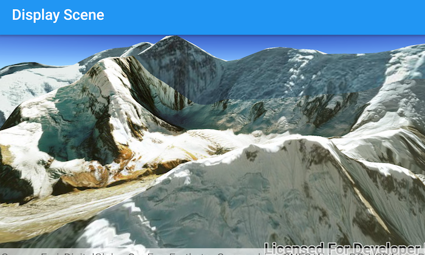

# Display a Scene
This sample demonstrates how to display an scene with elevation data.



## Features
* ArcGISScene
* ArcGISTiledElevationSource
* SceneView

## Developer Pattern
Create an `ArcGISScene` and set the `Basemap` with `ArcGISScene.setBasemap()`. Create a `SceneView` and set the scene to the view, `SceneView.setScene(scene)`.  Create a `Surface` and add an `ArcGISTiledElevationSource`, `Surface.getElevationSources().add()`. Set the surface as the scene's base surface `ArcGIScene.setBaseSurface(surface)`.

```java
// inflate MapView from layout
mSceneView = (SceneView) findViewById(sceneView);
// create a scene and add a basemap to it
ArcGISScene agsScene = new ArcGISScene();
agsScene.setBasemap(Basemap.createImagery());
mSceneView.setScene(agsScene);

// add base surface for elevation data
ArcGISTiledElevationSource elevationSource = new ArcGISTiledElevationSource(
        getResources().getString(R.string.elevation_image_service));
Surface surface = new Surface();
surface.getElevationSources().add(elevationSource);
agsScene.setBaseSurface(surface);

// add a camera and initial camera position
Camera camera = new Camera(28.4, 83.9, 10010.0, 10.0, 80.0, 300.0);
mSceneView.setViewpointCamera(camera);
```