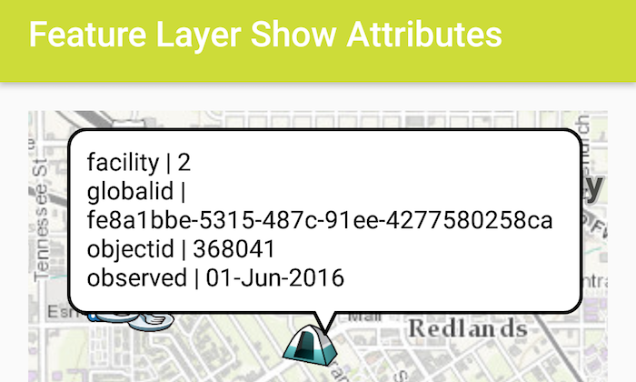

# Feature Layer Show Attributes
This sample shows how to return all loaded features from a query to show all attributes.



## Features
- Feature
- FeatureLayer
- FeatureQueryResult
- ServiceFeatureTable

## Sample Pattern
The sample creates an instance of `ServiceFeatureTable` and query's features based on user selected feature whereby we explicitly request all attributes to be returned with `ServiceFeatureTable.QueryFeatureFields.LOAD_ALL`.  `ArcGISFeature` objects are loadable so we get the `FeatureQueryResult` and iterate through the results creating a `Map` of all available attributes as name value pairs.  We use those name value pairs in a `Callout` for display.  

```java
// request all available attribute fields
final ListenableFuture<FeatureQueryResult> future = mServiceFeatureTable.queryFeaturesAsync(query, ServiceFeatureTable.QueryFeatureFields.LOAD_ALL);
// add done loading listener to fire when the selection returns
future.addDoneListener(new Runnable() {
    @Override
    public void run() {
        try {
            //call get on the future to get the result
            FeatureQueryResult result = future.get();
            // create an Iterator
            Iterator<Feature> iterator = result.iterator();
            // create a TextView to display field values
            TextView calloutContent = new TextView(getApplicationContext());
            calloutContent.setTextColor(Color.BLACK);
            calloutContent.setSingleLine(false);
            calloutContent.setVerticalScrollBarEnabled(true);
            calloutContent.setScrollBarStyle(View.SCROLLBARS_INSIDE_INSET);
            calloutContent.setMovementMethod(new ScrollingMovementMethod());
            calloutContent.setLines(5);
            // cycle through selections
            int counter = 0;
            Feature feature;
            while (iterator.hasNext()){
                feature = iterator.next();
                // create a Map of all available attributes as name value pairs
                Map<String, Object> attr = feature.getAttributes();
                Set<String> keys = attr.keySet();
                for(String key:keys){
                    Object value = attr.get(key);
                    // format observed field value as date
                    if(value instanceof GregorianCalendar){
                        SimpleDateFormat simpleDateFormat = new SimpleDateFormat("dd-MMM-yyyy", Locale.US);
                        value = simpleDateFormat.format(((GregorianCalendar) value).getTime());
                    }
                    // append name value pairs to TextView
                    calloutContent.append(key + " | " + value + "\n");
                }
                counter++;
                // center the mapview on selected feature
                Envelope envelope = feature.getGeometry().getExtent();
                mMapView.setViewpointGeometryAsync(envelope, 200);
                // show CallOut
                mCallout.setLocation(clickPoint);
                mCallout.setContent(calloutContent);
                mCallout.show();
            }
        } catch (Exception e) {
            Log.e(getResources().getString(R.string.app_name), "Select feature failed: " + e.getMessage());
        }
    }
});
return super.onSingleTapConfirmed(e);
}
});
```
