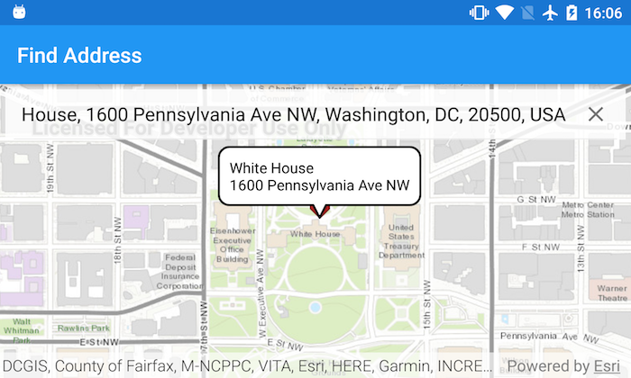

# Find address

This sample demonstrates how to geocode an address and show it on the map view.

## How to use the sample

Specify the point of interest in the `POI` SearchView (e.g. Starbucks). For the proximity field you can choose between your current location, by leaving the SearchView blank, or any other location by entering text. Suggestions will appear while the user is typing. When a suggestion is selected, or the submit query button is tapped, the resulting locations are shown on the map. Tapping on a pin will show details about that location in a callout. A button at the bottom called 'Redo Search in this Area' will let you search by the current viewpoint's midpoint.

## How it works

Create an `ArcGISMap` using a `Basemap`.

Add the map to the `MapView`, `MapView.setMap()`.
Create a `LocatorTask` using the world geocode service and define the `GeocodeParameters` for  the `LocatorTask`.

TODO
To geocode an address, set the geocode parameters and use <code>LocatorTask.geocodeAsync(geocodeParameters)</code>.</li>
    <li>To reverse geocode a location, get the <code>Point</code> location on the map view and use <code>LocatorTask.reverseGeocodeAsync(Point)</code>.</li>
    <li>Show the retrieved results by creating a <code>PictureMarkerSymbol</code> with attributes from the result and add that symbol to a <code>Graphic</code>  in the <code>GraphicsOverlay</code>.</li>

## Features

* ArcGISMap
* ArcGISTiledLayer
* Callout
* MapView
* LocatorTask
* GeocodeParameters
* GeocodeResult
* Graphic
* GraphicsOverlay
* Point
* PictureMarkerSymbol
* ReverseGeocodeParameters
* TileCache