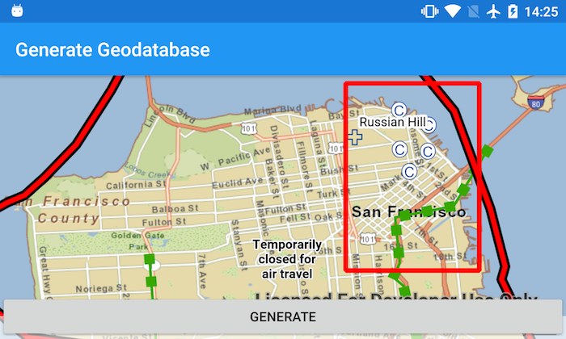

# Generate Geodatabase

This sample demonstrates how to generate a geodatabase from a feature service.

## How to use the sample

Zoom to any extent and click the generate button to generate a geodatabase of features from a feature service filtered to the current extent. A red bounding box graphic will display showing the extent used. A progress bar will show the job's progress. Once the geodatabase has been generated, the layers in the geodatabase will be added to the map.

## How it works

To generate a `Geodatabase` from a feature service:

- Create a `GeodatabaseSyncTask` with the URL of a feature service and load it.
- Create `GenerateGeodatabaseParameters` specifying the extent and whether to include attachments.
- Create a `GenerateGeodatabaseJob` with `GenerateGeodatabaseJob generateGeodatabaseJob = syncTask.generateGeodatabaseAsync(parameters, filePath)`. Start the job with `generateGeodatabaseJob.start()`.
- When the job is done, `generateGeodatabaseJob.getResult()` will return a `Geodatabase`. Inside the `Geodatabase` are `FeatureTable`s that can be used to add `FeatureLayer`s to the map.
- Lastly, it is good practice to call `syncTask.unregisterGeodatabaseAsync(geodatabase)` when not planning on syncing changes to the service.

## Features

* ArcGISMap
* FeatureLayer
* Geodatabase
* GenerateGeodatabaseJob 
* GenerateGeodatabaseParameters
* MapView
* ServiceFeatureTable