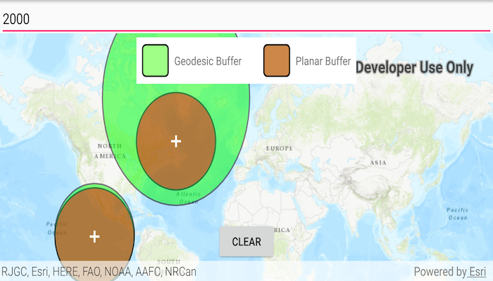

# Buffer
This sample demonstrates how to generate a polygon of a fixed distance around a point.

Creating buffers is a core concept in GIS as it allows for proximity analysis to find geographic features contained 
within a polygon. For example, suppose you wanted to know how many restaurants are within a short walking distance of
 your home. The simplest proximity analysis would be to generate a buffer polygon of a certain distance 
 (say 1 mile) around your house.

## How to use the sample
Tap on the map to create a buffer around the tapped location. Change the spinner value (in miles) to set the 
buffer distance.

## How it works
To create a Polygon with a radius:
The static method, `GeometryEngine.buffer`, is called by passing in a `Point` and a distance
 in meters. This returns a `Polygon` which can be displayed using a `Graphic`.

## Relevant API
* GeometryEngine.Buffer
* GraphicsOverlay 
* Point
* Polygon

#### Tags
* Analysis
* Buffer
* GeometryEngine
