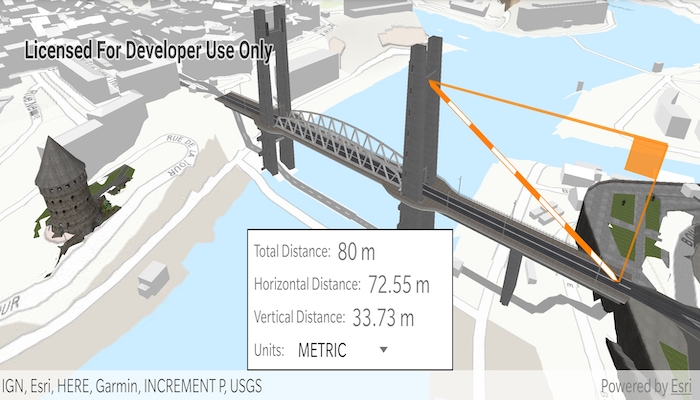

# Distance Measurement Analysis
Measure 3D distances between two points in a scene.

The distance measurement analysis allows you to add the same measuring experience found in ArcGIS Pro, City Engine,
and the ArcGIS API for JavaScript to your app. You can set the unit system of measurement (metric or imperial) and 
have the units automatically switch to one appropriate for the current scale. The rendering is handled internally 
so it doesn't interfere with other analyses like viewsheds.

# How To Use The Sample
Choose an unit system for the measurement in the UI dropdown. Single tap any location on the screen to set the start point
of measurement. Double tap and drag to set the end point of measurement. Single Tapping any new location will 
start a new measurement. 

# How It Works
To measure distances with the `LocationDistanceMeasurement` analysis:

1. Create an `AnalysisOverlay` and add it to your scene view's analysis overlay collection: 
`sceneView.getAnalysisOverlays().add(analysisOverlay)`. 
1. Create a `LocationDistanceMeasurement`, 
specifying the `startLocation` and `endLocation`. These can be the same point to start with. 
Add the analysis to the analysis overlay: 
`analysisOverlay.getAnalyses().add(LocationDistanceMeasurement)`. 
The measuring line will be drawn for you between the two points. 
1. The `measurementChanged` callback will fire if the distances change. You can get the new values 
for the `directDistance`, `horizontalDistance`, and `verticalDistance` from the `MeasurementChangedEvent` 
returned by the callback. The distance objects contain both a scalar value and a unit of measurement.

# Relevant API
* AnalysisOverlay
* LocationDistanceMeasurement
* UnitSystem

# Additional Information
The `LocationDistanceMeasurement` analysis only performs planar distance calculations. This may not be appropriate for 
large distances where the Earth's curvature needs to be taken into account.

#Tags
Analysis 
 

