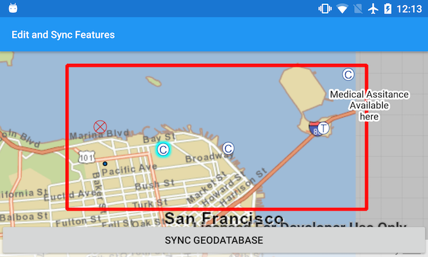

# Edit and sync features

This sample demonstrates how to synchronize offline edits with a feature service.



## How to use the sample

- Pan and zoom into the desired area, making sure the area you want to take offline is within the current extent of the `MapView`. 
- Tap on the Generate Geodatabase button. This will call `generateGeodatabase()`, which will return a `GenerateGeodatabaseJob`. 
- Once the job completes successfully, a `GeodatabaseFeatureTable` and a `FeatureLayer` are created from the resulting `Geodatabase`. The `FeatureLayer` is then added to the `ArcGISMap`. 
- Once the `FeatureLayer` generated from the local `Geodatabase` is displayed, a `Feature` can be selected by tapping on it. The selected `Feature` can be moved to a new location by tapping anywhere on the map. 
- Once a successful edit has been made to the `FeatureLayer`, the Sync Geodatabase button is enabled. This button synchronizes local edits made to the local `GeoDatabase` with the remote feature service using `syncGeodatabase()` which generates `SyncGeodatbaseParameters` and passes them to a `SyncGeodatabaseJob`.
- Once the job successfully completes, the local edits are synchronized with the feature service.

## Features

* FeatureLayer
* FeatureTable
* GeodatabaseSyncTask
* GenerateGeodatabaseJob
* GenerateGeodatabaseParameters
* SyncGeodatabaseJob
* SyncGeodatabaseParameters
* SyncLayerOption

## Provision your device
1. Download the data from [ArcGIS Online](https://arcgisruntime.maps.arcgis.com/home/item.html?id=72e703cd01654e7796eb1ae75af1cb53).  
2. Extract the contents of the downloaded zip file to disk.  
3. Create an ArcGIS/samples/MapPackage folder on your device. You can use the [Android Debug Bridge (adb)](https://developer.android.com/guide/developing/tools/adb.html) tool found in **<sdk-dir>/platform-tools**.
4. Open up a command prompt and execute the ```adb shell``` command to start a remote shell on your target device.
5. Navigate to your sdcard directory, e.g. ```cd /sdcard/```.  
6. Create the ArcGIS/samples/TileCache directory, ```mkdir ArcGIS/samples/TileCache```.
7. You should now have the following directory on your target device, ```/sdcard/ArcGIS/samples/TileCache```. We will copy the contents of the downloaded data into this directory. Note:  Directory may be slightly different on your device.
8. Exit the shell with the, ```exit``` command.
9. While still in your command prompt, navigate to the folder where you extracted the contents of the data from step 1 and execute the following command: 
	* ```adb push SanFrancisco.tpk /sdcard/ArcGIS/samples/TileCache```


Link | Local Location
---------|-------|
|[San Francisco Tile Cache](https://arcgisruntime.maps.arcgis.com/home/item.html?id=72e703cd01654e7796eb1ae75af1cb53)| `<sdcard>`/ArcGIS/samples/TileCache/SanFrancisco.tpk |