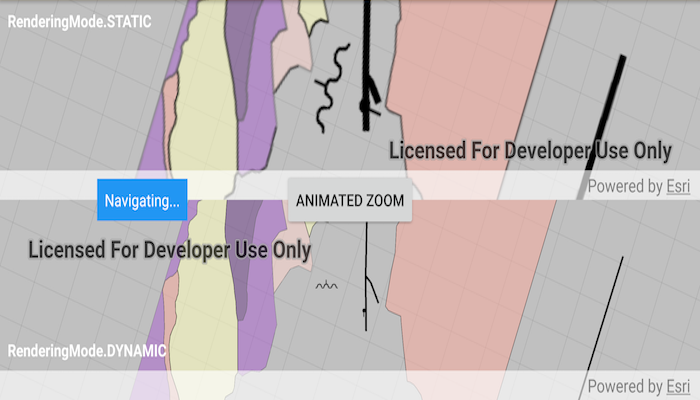

# Feature Layer Rendering Mode (Map)
Use load settings to set preferred rendering mode for feature layers, specifically static or dynamic rendering modes.

## How to use the sample
Use the 'Animated Zoom' button to trigger the same zoom animation on both static and dynamic maps and note the difference.

## How it works
1. Create an `ArcGISMap` and call `getLoadSettings()` and then `setPreferred[Point/Polyline/Polygon]FeatureRenderingMode(...)`.
1. The `RenderingMode` can be set to `STATIC`, `DYNAMIC` or `AUTOMATIC`.
1. `RenderingMode.STATIC` generally has better performance, however `Point`s don't stay screen-aligned and `Point`s/`Polyline`s/`Polygon`s are only redrawn once `MapView` navigation is complete.
1. `RenderingMode.DYNAMIC` generally has worse performance, however `Point`s remain screen-aligned and `Point`s/`Polyline`s/`Polygon`s are continually redrawn while the `MapView`  is navigating.
1. When left in `RenderingMode.AUTOMATIC`, `Point`s are drawn dynamically and `Polyline`s and `Polygon`s statically.

## Relevant API
* FeatureLayer
* FeatureLayer.RenderingMode
* LoadSettings

#### Tags
MapViews, SceneViews and UI
