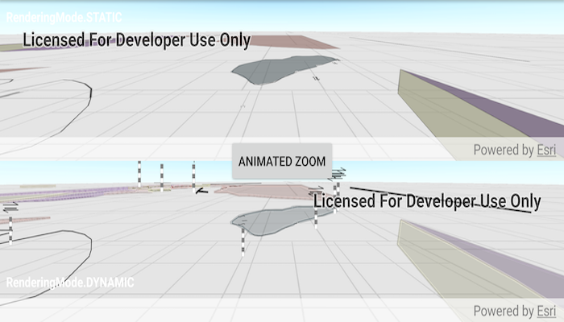

# Feature Layer Rendering Mode (Scene)
This sample demonstrates how to use load settings to set preferred rendering mode for feature layers, specifically static or dynamic rendering modes.

## Features
* FeatureLayer
* FeatureLayer.RenderingMode
* LoadSettings
* Scene
* SceneView

## Developer Pattern
1. Create an `ArcGISScene` and call `.getLoadSettings()` and then `.setPreferred[Point/Polyline/Polygon]FeatureRenderingMode(...)`.
1. The `RenderingMode` can be set to `STATIC`, `DYNAMIC` or `AUTOMATIC`.
1. `RenderingMode.STATIC` generally has better performance, however `Point`s don't stay screen-aligned and `Point`s/`Polyline`s/`Polygon`s are redrawn only periodically while the `SceneView` is navigating.
1. `RenderingMode.DYNAMIC` generally has worse performance, however `Point`s remain screen-aligned and `Point`s/`Polyline`s/`Polygon`s are continuously redrawn while the `SceneView`  is navigating.
1. When left to `RenderingMode.AUTOMATIC`, `Point`s are drawn dynamically and `Polyline`s and `Polygon`s statically.
