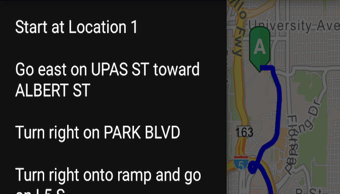

# Find route
This sample demonstrates how to get a route between two locations



#How to use the sample
For simplicity the sample comes with Source and Destination stops. You can click on the Navigation  Floating Action Button to get a route between the stops. Once a route is generated, the `DrawerLayout` is unlocked and you can view the direction maneuver as a list.

#Features

* RouteTask
* RouteResult
* RouteParameters
* Route
* DirectionManeuver

# How it works

The sample creates a `RouteTask` from a URL and uses default `RouteParameters` from the `RouteTask` service to set up the **stops**. In order to get detailed driving directions, `setReturnDirections` is set true in the parameters. `RouteTask.solveAsync` is used to solve for route. The `RouteResult` is then used to create the route graphics and `getDirectionManeuvers()` on route result returns step-by-step direction list which is populated in the `ListView`.

```java
                // create RouteTask instance
                mRouteTask = new RouteTask(getString(R.string.routing_service));

                final ListenableFuture<RouteParameters> listenableFuture = mRouteTask.generateDefaultParametersAsync();
                listenableFuture.addDoneListener(new Runnable() {
                    @Override
                    public void run() {
                        try {
                            if (listenableFuture.isDone()) {
                                int i = 0;
                                mRouteParams = listenableFuture.get();

                                // get List of Stops
                                List routeStops = mRouteParams.getStops();
                                // set return directions as true to return turn-by-turn directions 
                                // in the result of getDirectionManeuvers().
                                mRouteParams.setReturnDirections(true);

                                // add your stops to it
                                routeStops.add(new Stop(new Point(-13041171.537945, 3860988.271378, 
                                    SpatialReferences.getWebMercator())));
                                routeStops.add(new Stop(new Point(-13041693.562570, 3856006.859684, 
                                    SpatialReferences.getWebMercator())));

                                // solve
                                RouteResult result = mRouteTask.solveAsync(mRouteParams).get();
                                List routes = result.getRoutes();
                                mRoute = (Route) routes.get(0);
                                // create a route graphic
                                Graphic routeGraphic = new Graphic(mRoute.getRouteGeometry(), route);
                                // add route graphic to the map
                                graphicsOverlay.getGraphics().add(routeGraphic);
                                // get directions
                                // NOTE: to get turn-by-turn directions Route Parameters should set 
                                // returnDirection flag as true
                                List<DirectionManeuver> directions = mRoute.getDirectionManeuvers();

                                String[] directionsArray = new String[directions.size()];

                                for (DirectionManeuver dm : directions) {
                                    directionsArray[i++] = dm.getDirectionText();
                                }

                                // Set the adapter for the list view
                                mDrawerList.setAdapter(new ArrayAdapter<>(getApplicationContext(),
                                        R.layout.drawer_layout_text, directionsArray));

                                if (mProgressDialog.isShowing()) {
                                    mProgressDialog.dismiss();
                                }

                            }
                        } catch (Exception e) {
                            Log.e(TAG, e.getMessage());
                        }
                    }
                });
```
