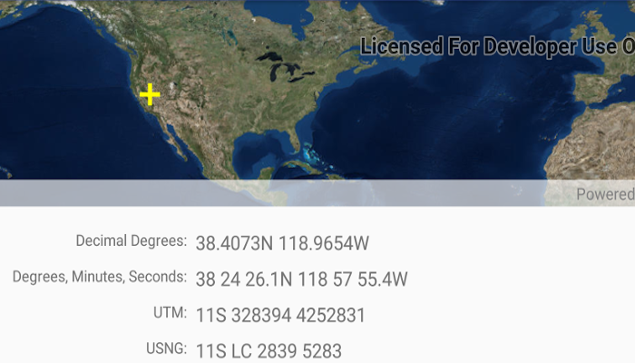

# Format coordinates
### Category: Manage Data


Coordinates can be written and formatted in different ways, for example latitude, longitude coordinates can be formatted as decimal degrees, or degrees, minutes, and seconds. This sample demonstrates how to convert a map location `Point` in WGS 1984 spatial reference to a number of different coordinate notations (decimal degrees; degrees, minutes, seconds; Universal Transverse Mercator (UTM), and United States National Grid (USNG)), by using `CoordinateFormatter`. Additionally, coodinate notation strings can be converted to a `Point` and shown in the map by tapping on the notation values shown and entering a coordinate in the appropriate notation. 

The `CoordinateFormatter` also supports Military Grid Reference System (MGRS), Global Area Reference System (GARS), and World Geographic Reference System (GEOREF) notations, using similar methods to those shown in this sample app.

## Features
* CoordinateFormatter
* Point
* Graphic
* DefaultMapViewOnTouchListener

## How to use the sample
* Tap on the map to see the formatted coordinates at the tapped location.
* Tap on a coordinate and enter a new coordinate string in the dialog; the graphic in the map, and also the other coordinates, will be updated from this new value.

## Developer Pattern
An inital default map location is shown in the `MapView` as a `Graphic`. The `CoordinateFormatter` methods `toLatitudeLongitude`, `toUtm`, and `toUSNG` are used to convert the `Point` representing the tapped map location to different coordinate notation formats. Note that the `toLatitudeLongitude` method can be used to format the coordinates in different ways, by passing in different `LatitudeLongitudeFormat` values:

```java
// use CoordinateFormatter to convert to Latitude Longitude, formatted as Decimal Degrees
mLatLongDDValue.setText(CoordinateFormatter.toLatitudeLongitude(newLocation,
  CoordinateFormatter.LatitudeLongitudeFormat.DECIMAL_DEGREES, 4));

// use CoordinateFormatter to convert to Latitude Longitude, formatted as Degrees, Minutes, Seconds
mLatLongDMSValue.setText(CoordinateFormatter.toLatitudeLongitude(newLocation,
  CoordinateFormatter.LatitudeLongitudeFormat.DEGREES_MINUTES_SECONDS, 1));
```

The `CoordinateFormatter` methods `fromLatitudeLongitude`, `fromUtm`, and `fromUSNG` are used to convert a coordinate string to a `Point` that is used to update the `Geometry` of the `Graphic`. Different methods may have different options for coordinates; for example the `fromUtm` method allows you to choose whether to format the UTM coordinate using a letter that signifies latitude bands, or alternatively a letter that indicates the hemisphere (N or S).

```java
// use CoordinateFormatter to parse UTM coordinates
convertedPoint = CoordinateFormatter.fromUtm(coordinateNotation, null, 
  CoordinateFormatter.UtmConversionMode.LATITUDE_BAND_INDICATORS);
```
