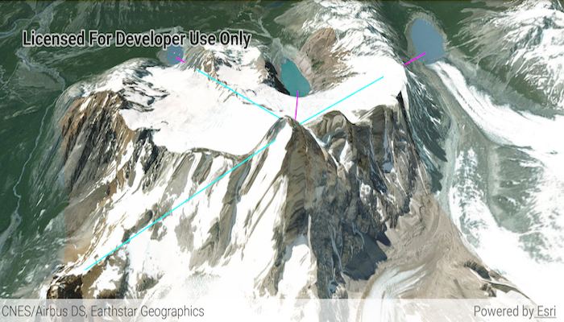

# Location Line of Sight

This sample demonstrates how to perform a line of sight analysis between two points in a SceneView.

## How it works
A `LineOfSight` analysis is a type of visual analysis you can perform on a scene. The `LineOfSight` analysis aims to answer the question: 'What are the visible and obstructed portions of a line between two locations?'. The output is a line, in an overlay, with two different colors - one representing visible areas, and the other representing obstructed areas.

1. Create a `LocationLineOfSight`, and assign values for the `observerLocation`, and `targetLocation`.
1. Once the `LocationLineOfSight` is created, add it to an `AnalysisOverlay`, and add the `AnalysisOverlay` to the `SceneView`.
1. The first screen tap, sets the `observerLocation`.
1. Each subsequent screen tap, sets the `targetLocation` and creates a new `LocationLineOfSight`.

## Features
- AnalysisOverlay
- ArcGISTiledElevationSource
- LocationLineOfSight
- SceneView
- Surface