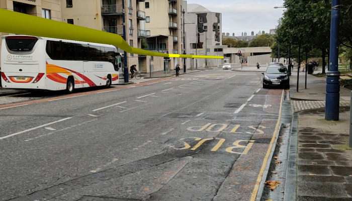

# Navigate in AR

Use a route displayed in the real world to navigate.

## Use case

It can be hard to navigate using 2D maps in unfamiliar environments. You can use full-scale AR to show a route overlaid on the real-world for easier navigation.

## How to use the sample

The sample opens with a map centered on the current location. Tap the map to add an origin and a destination and a route will be calculated between the two points and displayed as a polyline. When ready, click 'Start AR' to start the AR navigation. Calibrate the heading before starting to navigate. When you start, route instructions will be displayed and spoken. As you proceed through the route, new directions will be provided until you arrive.

## How it works

1. The map page is used to plan the route before starting the AR experience. See the [Find a route](https://github.com/Esri/arcgis-runtime-samples-android/tree/master/java/find-route) and [Mobile map search and route](https://github.com/Esri/arcgis-runtime-samples-android/tree/master/java/mobile-map-search-and-route) samples for a more focused demonstration of those workflow. Use the calibration button to bring up sliders to allow you to correct heading and altitude.
2. Pass the resulting `RouteResult` to the `ArNavigateActivity` used for the AR portion of the navigation experience.
3. Start ARCore tracking with continuous location updates when the AR view is shown.
4. Get the route geometry from the first route in the `RouteResult`.
5. Add the route geometry to a graphics overlay and add a renderer to the graphics overlay.
6. Allow the user to calibrate against a known dataset (in this sample we use surface imagery). Use a joystick slider to manipulate the heading (direction you are facing) and altitude of the scene. Because of limitations in on-device compasses, calibration is often necessary; small errors in heading cause big problems with the placement of scene content in the world.
    * Note that while this sample implemented a slider, there are many possible strategies for implementing heading calibration.
    * While calibrating, the basemap is shown at 50% opacity, to allow you to compare the basemap imagery with what is seen by the camera. While this works in some environments, it won't work indoors, in forested areas, or if the ground truth has changed since the basemap imagery was updated. Alternative scenarios can involve orienting relative to landmarks (for example, stage sets at a concert) or starting at a known orientation by lining up with a static image.
    * The slider in the sample implements a 'joystick' interaction; the heading is adjusted faster the further you move from the center of the slider.
7. When the user hits the `Navigate` button, create a `RouteTracker`, providing a `RouteResult` and the index of the route you want to use; this sample always picks the first returned result.
8. Create a location data source and listen for location change events.
9. Keep the calibration view accessible throughout the navigation experience. As the user walks, small heading errors may become more noticeable and require recalibration.

## Relevant API

* ArcGISARView
* GeometryEngine
* LocationDataSource
* RouteResult
* RouteTask
* RouteTracker
* Surface

## About the data

This sample uses Esri's [world elevation service](https://elevation3d.arcgis.com/arcgis/rest/services/WorldElevation3D/Terrain3D/ImageServer) to ensure that route lines are placed appropriately in the 3D space. It uses the [world routing service](https://www.arcgis.com/home/item.html?id=1feb41652c5c4bd2ba5c60df2b4ea2c4) to calculate routes. The world routing service requires authentication and does consume ArcGIS Online credits.

## Additional information

This sample requires a device that is compatible with ARKit 1 on iOS or ARCore 1.8 on Android.

Unlike other scene samples, there's no need for a basemap while navigating, because context is provided by the camera feed showing the real environment. The base surface's opacity is set to zero to prevent it from interfering with the AR experience. During calibration, the basemap is shown at 50% opacity to help the user verify that they have calibrated properly.

A digital elevation model is used to ensure that the displayed route is positioned appropriately relative to the terrain of the route. If you don't want to display the route line floating, you could show the line draped on the surface instead.

**Real-scale AR** is one of three main patterns for working with geographic information in augmented reality. See [Augmented reality](https://developersdev.arcgis.com/rt/shared_for_review/display-scenes-in-augmented-reality.htm) in the guide for more information.

Because most navigation scenarios involve traveling beyond the accurate range for ARCore positioning, this sample relies on **continuous location updates** from the location data source.

#### Tags
Augmented Reality
directions
full-scale
guidance
mixed reality
navigate
navigation
real-scale
route
routing
world-scale
