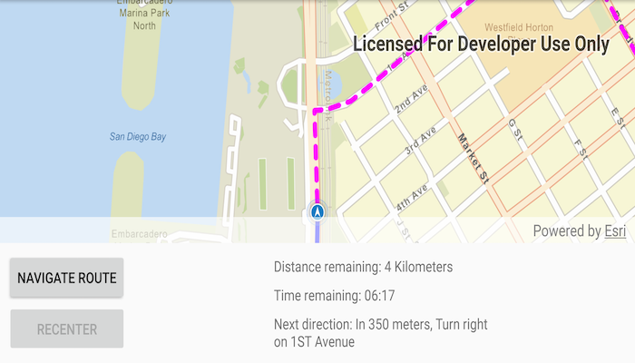

# Navigate route

Use a routing service to navigate between two points.

## Use case

Navigation is often used by field workers while traveling between points to get live directions based on their location.

## How to use the sample

Click 'Navigate Route' to simulate travelling and to receive directions from a preset starting point to a preset destination. If you pan away from the location display, use the 'Recenter' button to return the map view to set the auto pan mode back to `NAVIGATION`.

## How it works

1. Create a `RouteTask` using a URL to an online route service.
2. Generate default `RouteParameters`.
4. Add `Stop`s to the parameters.
5. Solve the route to get a `RouteResult`.
6. Create a `RouteTracker` using the route result, and the index of the desired route to take.
7. Use `trackLocationAsync(LocationDataSource.Location)` to track the location of the device and update the route tracking status.
8. Add a listener to capture `TrackingStatusChangedEvent`s, then get the `TrackingStatus` and use it to display updated route information. Tracking status includes a variety of information on the route progress, such as the remaining distance, remaining geometry or traversed geometry (represented by a `Polyline`), or the remaining time in minutes (`Double`), amongst others.
9. Add a `NewVoiceGuidanceListener` to get `VoiceGuidance` whenever new instructions are available. From the voice guidance, get the `String` representing the directions and use a text-to-speech engine to output the maneuver directions.
10. You can also query the tracking status for the current `DirectionManeuver` index, retrieve that maneuver from the `Route` and get it's direction text to display in the GUI.
11. To establish whether the destination has been reached, get the `DestinationStatus` from the tracking status. If the destination status is `REACHED`, and the `remainingDestinationCount` is 1, we have arrived at the destination and can stop routing. If there are several destinations in your route, and the remaining destination count is greater than 1, switch the route tracker to the next destination.

## Relevant API

* DestinationStatus
* DirectionManeuver
* Location
* LocationDataSource
* ReroutingStrategy
* Route
* RouteParameters
* RouteTask
* RouteTracker
* Stop
* VoiceGuidance

## About the data

The route taken in this sample interacts with three locations:
- Starts at the San Diego Convention Center, site of the annual Esri User Conference
- Stops at the USS San Diego Memorial
- Ends at the Fleet Science Center, San Diego.

## Tags
Routing and logistics
directions
maneuver
navigation
route
turn-by-turn
voice
