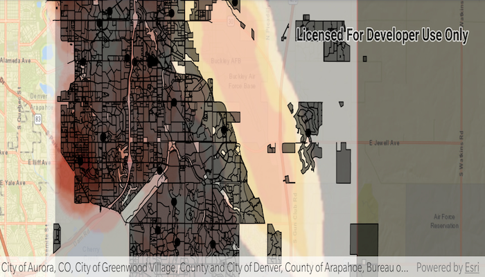

# Read GeoPackage

This sample demonstrates how to read rasters and feature tables from geopackages and display them as layers in an map.

## Features

* FeatureLayer
* GeoPackage
* GeoPackageFeatureTable
* GeoPackageRaster
* Layer
* RasterLayer

## How to use the sample

The `Layer`s in the `GeoPackage` are shown in a drawer on the left hand side of the screen. Click on a `Layer` to add or remove it from map.

## Developer Pattern

1. Create a `GeoPackage` using a path a the local GeoPackage file.
1. Load the `GeoPackage` with `loadAsync()`.
1. Use `GeoPackage.getGeoPackageRasters()` to get each `GeoPackageRaster` and use them to make `RasterLayer`s.
1. Use `GeoPackage.getGeoPackageFeatureTables()` to get each `GeoPackageFeatureTable` and use them to make `FeatureLayer`s.
1. Based on user input, add or remove these `Layer`s from the `ArcGISMap`'s operationalLayers.

## Provision your device
1. Download the data from [ArcGIS Online](https://www.arcgis.com/home/item.html?id=68ec42517cdd439e81b036210483e8e7).
1. Extract the contents of the downloaded zip file to disk.
1. Open your command prompt and navigate to the folder where you extracted the contents of the data from step 1.
1. Execute the following command: `adb push AuroraCO.gpkg /sdcard/ArcGIS/Samples/GeoPackage/AuroraCO.gpkg`

Link | Local Location
---------|-------|
|[Aurora CO GeoPackage](https://www.arcgis.com/home/item.html?id=68ec42517cdd439e81b036210483e8e7)| `<sdcard>`/ArcGIS/Samples/GeoPackage/AuroraCO.gpkg|