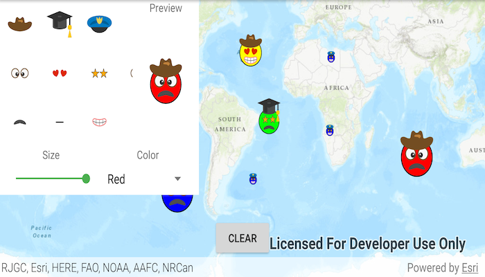

# Read symbols from a mobile style

Open a mobile style (.stylx) and read its contents. Combine several 
symbols from the style into a single multilayer point symbol, then use
it to display graphics in the map view.

## Use case

Multilayer symbols provide the ability to create more complex and
interesting symbology for geoelements. While these symbols can be
created from scratch, a more convenient workflow is to author them using
ArcGIS Pro and store them in a mobile style file (.stylx). ArcGIS
Runtime can read symbols from a mobile style, and you can modify and
combine them as needed in your app.

## How to use the sample

* Select symbols from each recycler view to create a face emoji. A
  preview of the symbol is updated as you make selections.
* You can optionally select a new color from the drop down list and set
  the symbol size using the seek bar.
* Tap the map to create a point graphic that uses the current face symbol.
* Tap the `Clear` button to clear all graphics from the display.

## How it works

1. On startup, read a mobile style file using `loadAsync()`. 
2. Get a list of all symbols in the style by calling
   `searchSymbolsAsync()` with the default search parameters.
3. Iterate the list of `SymbolStyleSearchResult` and add symbols to
   recycler views according to their category. Display a preview of each
   symbol with `createSwatchAsync(...)`.
4. When symbol selections change, create a new multilayer symbol by
   passing the keys for the selected symbols into
   `getSymbolsAsync(...)`. Color lock all symbol layers except the base
   layer and update the current symbol preview image.
5. Create graphics symbolized with the current symbol when the user taps
   the map view.

## Relevant API

* MultilayerPointSymbol
* MultilayerSymbol.createSwatchAsync(...)
* SymbolLayer
* SymbolStyle
* SymbolStyle.getSymbolAsync(...)
* SymbolStyleSearchParameters

## Offline Data
1. Download the data from
   [ArcGIS Online](https://arcgisruntime.maps.arcgis.com/home/item.html?id=1bd036f221f54a99abc9e46ff3511cbf).
1. Extract the contents of the downloaded zip file to disk.
1. Open your command prompt and navigate to the folder where you extracted the contents of the data from step 1.
4. Execute the following command: `adb push emoji-mobile.stylx
   /sdcard/ArcGIS/Samples/Style/emoji-mobile.stylx`

Link | Local Location
---------|-------|
|[Emoji mobile style](https://arcgisruntime.maps.arcgis.com/home/item.html?id=1bd036f221f54a99abc9e46ff3511cbf)| `<sdcard>`/ArcGIS/Samples/Style/emoji-mobile.stylx |

## Tags
Visualization 
advanced symbology 
multilayer 
mobile style 
stylx
