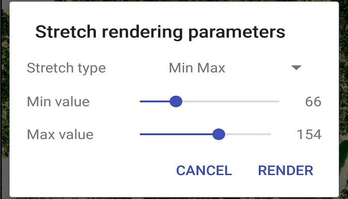

# Stretch renderer

Use a stretch renderer to enhance the visual contrast of raster data for analysis.

## Use case

An appropriate stretch renderer can enhance the contrast of raster imagery, allowing the user to control how their data is displayed for efficient imagery analysis.

## How to use the sample

Choose one of the stretch parameter types from the wrench icon in the action bar:

* Standard deviation - a linear stretch defined by the standard deviation of the pixel values
* Min-max - a linear stretch based on minimum and maximum pixel values
* Percent clip - a linear stretch between the defined percent clip minimum and percent clip maximum pixel values

Then configure the parameters and tap 'Render'.

## How it works

1. Create a `Raster` from a raster file.
2. Create a `RasterLayer` from the raster.
3. Create a `Basemap` from the raster layer with `Basemap(RasterLayer)` and set it to the map with `ArcGISMap(basemap)`.
4. Create a `StretchRenderer`, specifying the stretch parameters and other properties.
5. Set the stretch renderer on the raster layer with `rasterLayer.setRasterRenderer(stretchRenderer)`.

## Relevant API

* MinMaxStretchParameters
* PercentClipStretchParameters
* Raster
* RasterLayer
* StandardDeviationStretchParameters
* StretchParameters
* StretchRenderer

## Offline Data

1. Download the data from [ArcGIS Online](https://arcgisruntime.maps.arcgis.com/home/item.html?id=7c4c679ab06a4df19dc497f577f111bd).
2. Extract the contents of the downloaded zip file to disk.
3. Open your command prompt and navigate to the folder where you extracted the contents of the data from step 1.
4. Push the data into the scoped storage of the sample app:
`adb push raster-file /Android/data/com.esri.arcgisruntime.sample.stretchrenderer/files/raster-file`
	
## About the data

This sample uses a raster imagery tile of an area of forested mountainous terrain and rivers.

## Additional information

See [Stretch function](http://desktop.arcgis.com/en/arcmap/latest/manage-data/raster-and-images/stretch-function.htm) in the *ArcMap* documentation for more information about the types of stretches that can be performed.

## Tags

analysis, deviation, histogram, imagery, interpretation, min-max, percent clip, pixel, raster, stretch, symbology, visualization
