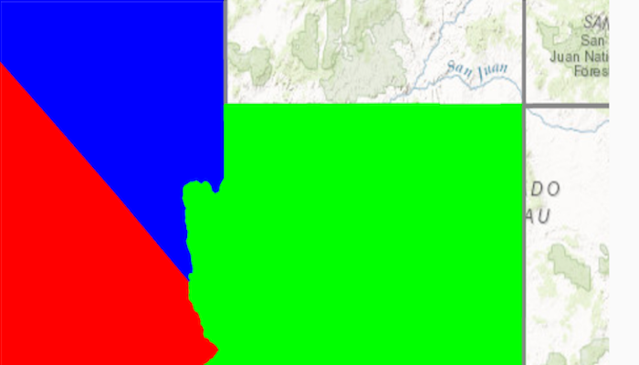

# Unique Value Renderer
Use a unique value renderer to style different features in a feature layer with different symbols. Features do not have a symbol property for you to set, renderers should be used to define the symbol for features in feature layers. The unique value renderer allows for separate symbols to be used for features that have specific attribute values in a defined field.

## How to use the sample
Simply run the app.

## How it works
First a service feature table and feature layer are constructed and added to the map. Then a unique value renderer is created and the field name to be used as the renderer field is set ("STATE_ABBR"). You can use multiple fields, this sample only uses one. Multiple simple fill symbols are defined for each type of feature we want to render differently (in this case different states of the USA). Simple fill symbols can be applied to polygon features, these are the types of features found in the feature service used for this service feature table. A default symbol is also created, this will be used for all other features that do not match the unique values defined.  Separate unique value objects are created which define the values in the renderer field and what symbol should be used for features that match. These are added to the unique values collection. The renderer is set on the layer and is rendered in the map view accordingly.

## Relevant API
* ServiceFeatureTable
* SimpleFillSymbol
* SimpleLineSymbol
* UniqueValueRenderer

#### Tags
Visualization