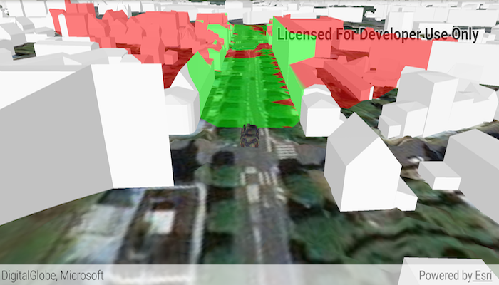

# Viewshed GeoElement

A viewshed shows the visible and obstructed areas from an observer's vantage point. This sample demonstrates how to attach a viewshed to a moving GeoElement.

# How to use the sample

Once the scene is done loading, click on a location for the tank to drive to. It will automatically turn and drive straight towards the tapped point. The viewshed will automatically move and rotate with the tank.

# How it works

To attach a viewshed to a `GeoElement`:

1. Create a `Graphic` and add it to a `GraphicsOverlay`.
1. Use a `SimpleRenderer` in the `GraphicsOverlay` which has a heading expression set. This way you can relate the viewshed's heading to the `GeoElement`'s heading.
1. Create a `GeoElementViewshed` with the graphic, heading/pitch offsets, and min/max distance.
1. To offset the viewshed's observer location from the center of the graphic, use `viewshed.setOffsetX()`, etc.

# Features

* AnalysisOverlay
* ArcGISTiledElevationSource
* ArcGISSceneLayer
* GeoElementViewshed
* SceneView