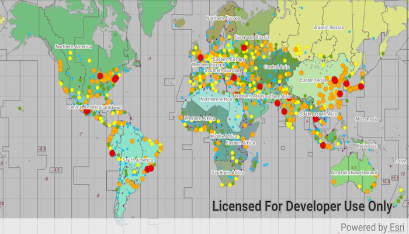

# WMTS layer

Display a layer from a Web Map Tile Service.
 

## Use case

WMTS services can have several layers. You can use Runtime to explore the layers available from a service. This would commonly be used to enable a browsing experience where users can choose which layers they want to display at run time.

## How to use the sample

Pan and zoom to explore the WMTS layer, which is displayed automatically.
 
## How it works
 
1. Create a `WmtsService` using the URL of the WMTS Service.
1. After loading the WMTS service, get the list of `WmtsLayerInfos` from the service info: `service.getServiceInfo().getLayerInfos()`
1. Use one of the layer infos to create a new `WmtsLayer(layerInfos.get(0))`
1. Set it as the maps' basemap with `map.setBasemap(new Basemap(wmtsLayer))`.

## Relevant API

* WmtsLayer
* WmtsLayerInfo
* WmtsService
* WmtsServiceInfo

## About the data

The map visualizes world time zones.

## Tags

layer, OGC, raster, tiled, web map tile service
