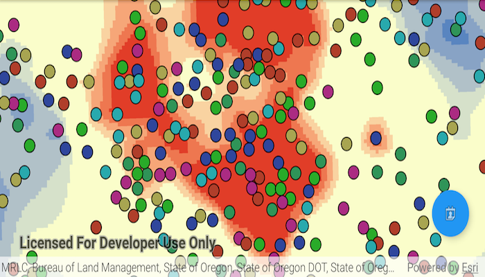

# Analyze Hotspots

This sample demonstrates how to execute a geoprocessing task to calculate a hotspot analysis based on the frequency of 911 calls. It calculates the frequency of these calls within a given study area during a specified constrained time period set between 1998-01-01 and 1998-05-31.



## Features

* GeoprocessingJob
* GeoprocessingParameters
* GeoprocessingResult
* GeoprocessingTask

## How to use the sample

Select a From: and To: date from the dialog and tap on the `Analyze`. The results will be shown on the map on successful completion of the Geoprocessing Job

## How it works

A `GeoprocessingTask` is created by setting the URL to the REST endpoint of a geoprocessing service.
`GeoprocessingParameters` are created asynchronously from the `GeoprocessingTask`.

```kotlin
val geoprocessingTask = GeoprocessingTask(getString(R.string.hotspot_911_calls))
```

Once the date ranges are selected, a query string is created with the 'to' and 'from' dates. The query string is then added as a key/value parameter input to the `GeoprocessingParameters`.

```kotlin
val geoprocessingParameters = paramsFuture.get()
geoprocessingParameters.processSpatialReference = mapView.spatialReference
geoprocessingParameters.outputSpatialReference = mapView.spatialReference

val queryString = StringBuilder("(\"DATE\" > date '")
      .append(from)
      .append(" 00:00:00' AND \"DATE\" < date '")
      .append(to)
      .append(" 00:00:00')")

val geoprocessingString = GeoprocessingString(queryString.toString())
geoprocessingParameters.inputs.put("Query", geoprocessingString)
```

A `GeoprocessingJob` is then obtained by calling  `.createJob(geoprocessingParameters)` method of the `GeoprocessingTask`. The job is started, and once complete, the `ArcGISMapImageLayer` is obtained from the result, and added to the `ArcGISMap`.

```kotlin
// create and start geoprocessing job
val geoprocessingJob = geoprocessingTask.createJob(geoprocessingParameters)
geoprocessingJob.start()

// show progress
val progressDialog = progressDialog(message = getString(R.string.dialog_text), title = getString(R.string.app_name))

// update progress
geoprocessingJob.addProgressChangedListener {
  val progress = geoprocessingJob.progress
  progressDialog.progress = progress
}

geoprocessingJob.addJobDoneListener {
  when {
      geoprocessingJob.status == Job.Status.SUCCEEDED -> {
          progressDialog.dismiss()
          // get results
          val geoprocessingResult = geoprocessingJob.result
          val hotspotMapImageLayer = geoprocessingResult.mapImageLayer

          // add new layer to map
          mapView.map.operationalLayers.add(hotspotMapImageLayer)

          // zoom to the layer extent
          hotspotMapImageLayer.addDoneLoadingListener {
              mapView.setViewpointGeometryAsync(hotspotMapImageLayer.fullExtent)
          }
      }
      isCanceled -> alert(getString(R.string.job_canceled))
      else -> alert(getString(R.string.job_failed))
  }
}
```

#### Tags
Analysis
