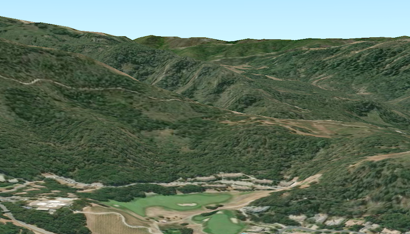

# Create terrain from a local tile package

Set the terrain surface with elevation described by a local tile package.

## Use case

The terrain surface is what the basemap, operational layers, and graphics are draped on. The tile package must be a LERC (limited error raster compression) encoded TPK. Details on creating these are in the [ArcGIS Pro documentation](https://pro.arcgis.com/en/pro-app/help/sharing/overview/tile-package.htm).

Terrain can be loaded offline from tile packages (.tpk).

## How it works

1. Create an `ArcGISScene` and add it to a `SceneView`.
1. Create an `ArcGISTiledElevationSource` with the path to the local tile package.
1. Add this source to the scene's base surface: `ArcGISScene.baseSurface.elevationSources.add(ArcGISTiledElevationSource)`.

## Relevant API

- ArcGISTiledElevationSource
- Surface

## About the data

This terrain data comes from Monterey, California.

## Offline data

1. Download the data from [ArcGIS Online](https://arcgisruntime.maps.arcgis.com/home/item.html?id=cce37043eb0440c7a5c109cf8aad5500).
1. Extract the contents of the downloaded zip file to disk.
1. Open your command prompt and navigate to the folder where you extracted the contents of the data from step 1.
1. Execute the following command:

`adb push MontereyElevation.tpk /Android/data/com.esri.arcgisruntime.sample.createterrainfromalocaltilepackage/files/MontereyElevation.tpk`

Link | Local Location
---------|-------|
|[Monterey Elevation TPK](https://arcgisruntime.maps.arcgis.com/home/item.html?id=cce37043eb0440c7a5c109cf8aad5500)| /Android/data/com.esri.arcgisruntime.sample.createterrainfromalocaltilepackage/files/MontereyElevation.tpk |

#### Tags
Maps & Scenes
3D
Tile Cache
Elevation
Surface
