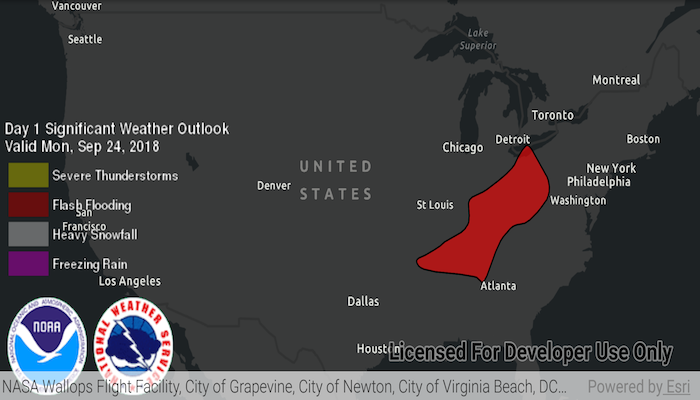

# Display KML

Display KML from a URL, portal item, or local KML file.

## Use case

Keyhole Markup Language (KML) is a data format used by Google Earth. KML is popular as a transmission format for consumer use and for sharing geographic data between apps. You can use Runtime to display KML files, with full support for a variety of features, including network links, 3D models, screen overlays, and tours.

## How to use the sample

Use the drop-down menu to select a source. A KML file from that source will be loaded and displayed in the map.

Before attempting to load a KML file from local storage, the file will have to be sideloaded onto the device. See [Offline Data](#offline-data).

## How it works
1. To create a KML layer from a URL, create a `KMLDataset` using the URL to the KML file. Then pass the data set to the `KmlLayer` constructor.
2. To create a KML layer from a portal item, construct a `PortalItem` with a portal and the KML portal item. Pass the portal item to the `KmlLayer` constructor.
1. To create a KML layer from a local file, create a `KMLDataset` using a path to the local KML file in external storage. Then pass the data set to the `KmlLayer` constructor.
1. Add the layer as an operational layer to the map with `map.operationalLayers().add(kmlLayer)`.

## Relevant API

* KmlDataset
* KmlLayer

## Offline Data
1. Download the data from [ArcGIS Online](https://arcgisruntime.maps.arcgis.com/home/item.html?id=324e4742820e46cfbe5029ff2c32cb1f).
1. Extract the contents of the downloaded zip file to disk.
1. Open your command prompt and navigate to the folder where you extracted the contents of the data from step 1.
1. Execute the following command:
`adb push US_State_Capitals.kml 
/Android/data/com.esri.arcgisruntime.sample.displaykml/files/US_State_Capitals.kml`

Link | Local Location
---------|-------|
|[US State Capitals KML](https://arcgisruntime.maps.arcgis.com/home/item.html?id=324e4742820e46cfbe5029ff2c32cb1f)| /Android/data/com.esri.arcgisruntime.sample.displaykml/files/US_State_Capitals.kml|

## About the data

This sample displays three different KML files:

* From URL - this is a map of the significant weather outlook produced by NOAA/NWS. It uses KML network links to always show the latest data.
* From local file - this is a map of U.S. state capitals. It doesn't define an icon, so the default pushpin is used for the points.
* From portal item - this is a map of U.S. states.

## Tags
keyhole, KML, KMZ, OGC
