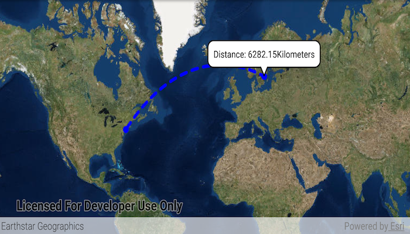

# Geodesic operations

Calculate a geodesic path between two points and measure its distance.

## Use case

A geodesic distance provides an accurate, real-world distance between two points. Visualizing flight paths between cities is a common example of a geodesic operation since the flight path between two airports takes into account the curvature of the earth, rather than following the planar path between those points, which appears as a straight line on a projected map.

## How to use the sample

Tap anywhere on the map. A line graphic will display the geodesic line between the two points. In addition, text that indicates the geodesic distance between the two points will be updated. Tap elsewhere and a new line will be created.

## How it works

1. Create a `Point` and display it as a `Graphic`.
2. Obtain a new point when a tap occurs on the `MapView` and add this point as a graphic.
3. Create a `Polyline` from the two points.
4. Execute `GeometryEngine.densifyGeodetic(...)` by passing in the created polyine then create a graphic from the returned `Geometry`.
5. Execute `GeometryEngine.lengthGeodetic(...)` by passing in the two points and display the returned length on the screen.

## Relevant API

* GeometryEngine.densifyGeodetic
* GeometryEngine.lengthGeodetic

## About the data

The Imagery basemap provides the global context for the displayed geodesic line.

## Tags

 densify, distance, geodesic, geodetic
 
