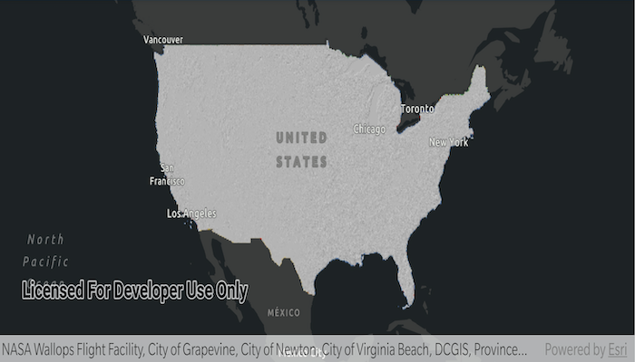

# Raster Function Service

Raster functions are operations performed on a `Raster`to apply on-the-fly processing such as Hillshade.  This sample demonstrates how to create an `ImageServiceRaster` and apply a `RasterFunction` to it. The `RasterFunction` applied in this case is Hillshade.



## Features

* ImageServiceRaster
* RasterFunction
* RasterLayer

## Developer Pattern

To create a `Raster` from a `RasterFunction`:

* Create a `RasterFunction` from a json string resource.
* Create a `RasterFunctionArguments` from the `RasterFunction`.
* Set a `Raster` with a name parameter in `RasterFunctionArguments`
* Create a new `Raster` from the `RasterFunction`.
* Add it as an operational layer with `mapView.map.operationalLayers.add(hillshadeLayer)`.

```kotlin
fun applyRasterFunction(raster: Raster){
    // create raster function from json string
    val rasterFunction = RasterFunction.fromJson(resources.getString(R.string.hillshade_simplified))
    // get parameter name value pairs used by hillshade
    val rasterFunctionArguments = rasterFunction.arguments
    // get list of raster names associated with raster function
    val rasterName = rasterFunctionArguments.rasterNames
    // set raster to the raster name
    rasterFunctionArguments.setRaster(rasterName[0], raster)
    // create raster as raster layer
    val raster = Raster(rasterFunction)
    val hillshadeLayer = RasterLayer(raster)
    // add hillshade raster
    mapView.map.operationalLayers.add(hillshadeLayer)
}
```

The sample also zooms to the extent of the `ImageServiceRaster`.  Currently we do not support zooming a `RasterLayer` out beyond 4 times it's published level of detail. The sample uses `MapView.setViewpointCenterAsync()` method to ensure the image shows when the app starts. You can see the effect of the image service not showing when you zoom out to the full extent of the image and beyond. 

```kotlin
// zoom to the extent of the raster service
imageRasterLayer.addDoneLoadingListener {
    if(imageRasterLayer.loadStatus == LoadStatus.LOADED){
        // zoom to extent of raster
        val centerPnt = imageServiceRaster.serviceInfo.fullExtent.center
        mapView.setViewpointCenterAsync(centerPnt, 55000000.0)
        // update raster with simplified hillshade
        applyRasterFunction(imageServiceRaster)
    }
}
```
