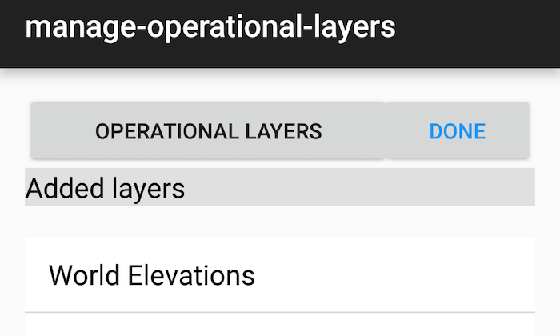

# Manage Operational Layers
The sample demonstrates how to add, remove and reorder operational layers in a map



## Features
* ArcGISMap
* MapView
* LayerList
* ArcGISMapImageLayer

## How to use the sample
Two map image layers are already added to the map in this sample. When you launch this sample you will see a MapView with a basemap and the two operational layers on it. When you press the **Operational Layers** button the sample switches to the second activity where you will see two lists. One which shows all the operational layers added to the map and the other which shows the layers that have been removed from the map. In the Added Layers list you can tap and delete the layer from the map, or long press and change the order in which the layers are added on to the map. In the Removed Layers list you can tap and add the layer back to the map.

## Developer Pattern
### LayerList
LayerList represents the operational layers of a Map or the base or reference layers of a Basemap. when the layers in the list are rendered in a MapView, the changes in the list have an immediate effect on how these layers are rendered in the MapView.

```java
private LayerList mMapOperationalLayers;
....
// get the LayerList from the Map
mOperationalLayers = mMap.getOperationalLayers();
....
// remove layer from map
mMapOperationalLayers.remove(position);
....
// add layer to the map
 mMapOperationalLayers.add(position);
```
