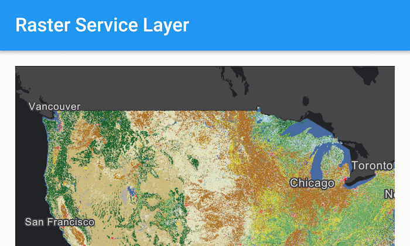

# Raster Layer File
This sample demonstrates how to create an `ImageServiceRaster` and add it to a `RasterLayer`. An `ImageServiceRaster` allows you to work with an image map service exposed by the ArcGIS Server Rest API.



## Features
- Raster
- RasterLayer

## Developer Pattern
To add a `RasterLayer` as an operational layer from an `ImageServiceRaster`:

- Create an `ImageServiceRaster` from a service url as `String`.
- Create a `RasterLayer` from the `ImageServiceRaster`.
- Add it as an operational layer with `map.getOperationalLayers().add(rasterLayer)`.

```java
// create image service raster as raster layer
 final ImageServiceRaster imageServiceRaster = new ImageServiceRaster(getResources().getString(R.string.image_service_url));
 final RasterLayer rasterLayer = new RasterLayer(imageServiceRaster);
 // add raster layer as map operational layer
 map.getOperationalLayers().add(rasterLayer);
```

The sample also zooms to the extent of the `ImageServiceRaster`.  Currently we do not support zooming a `RasterLayer` out beyond 4 times it's published level of detail. The sample uses `MapView.setViewpointCenterAsync()` method to ensure the image shows when the app starts. You can see the effect of the image not showing when you zoom out to the full extent of the image and beyond. 

```java
// zoom to the extent of the raster service
rasterLayer.addDoneLoadingListener(new Runnable() {
    @Override
    public void run() {
        if(rasterLayer.getLoadStatus() == LoadStatus.LOADED){
            // get the center point
            Point centerPnt = imageServiceRaster.getServiceInfo().getFullExtent().getCenter();
            mMapView.setViewpointCenterAsync(centerPnt, 55000000);
        }
    }
});
```