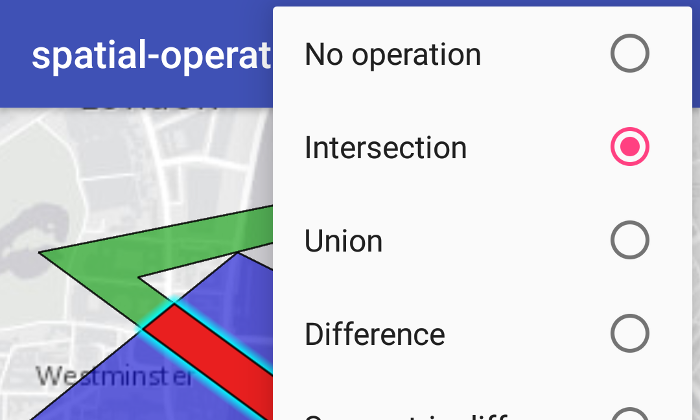

# Spatial operations



Demonstrates how to perform geometry-on-geometry spatial operations by using ```GeometryEngine```. Two input ```Polygons``` are added as ```Graphics``` to a ```GraphicsOverlay``` and displayed in a ```MapView```. Using the options menu, different spatial operations can be performed, the result of which is shown as a third ```Graphic```, in red, in the ```MapView```. Additionally, the `union` method is used to create an initial geometry with which to set the ```Viewpoint``` of the ```MapView```.

## Features
* ```GeometryEngine.difference```
* ```GeometryEngine.intersection```
* ```GeometryEngine.symmetricDifference```
* ```GeometryEngine.union```
* ```Graphic```
* ```GraphicsOverlay```
* ```MapView.setViewpointGeometryWithPaddingAsync```

## Developer Pattern
The ```GeometryEngine``` methods ```difference```, ```intersection```, ```symmetricDifference```, and ```union``` all perform geometry-on-geometry operations against two ```Geometry``` objects. The result is represented by a third ```Geometry``` that is returned from the method call.

```java
// perform intersection
GeometryEngine.intersection(inputPolygon1, inputPolygon2)
// perform union
GeometryEngine.union(inputPolygon1, inputPolygon2)
// ...
```