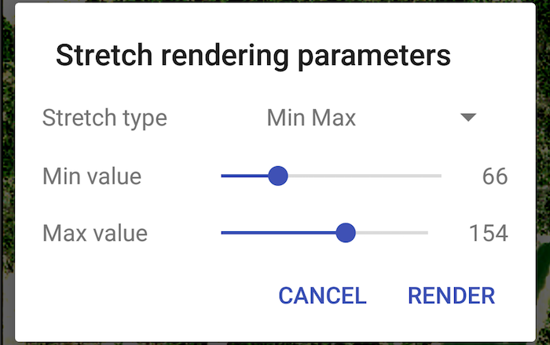

# Stretch Renderer

Demonstrates how to use a `StretchRenderer` on a `RasterLayer`. A `StretchRenderer` can be used to stretch tightly grouped values across the available value spectrum, creating more contrast between objects. This is useful for identifying objects in dark images.

## How to use the sample

Choose one of the stretch parameter types. The other options will adjust based on the chosen type.

## How it works

To apply a `StretchRenderer` to a `RasterLayer`:

1. Create a `Raster` from a raster file.
2. Create a `RasterLayer` from the `Raster`.
3. Create a `Basemap` from the `RasterLayer` and set it to the map.
4. Create a `StretchRenderer`, specifying the stretch parameters and other properties.
5. Set the `Renderer` on the `RasterLayer` with `rasterLayer.setRenderer(renderer)`.

## Features

- ArcGISMap
- Basemap
- MapView
- Raster
- RasterLayer
- StretchParameters
- StretchRenderer

## Provision your device
1. Download the **raster-file.zip** data from [ArcGIS Online](https://arcgisruntime.maps.arcgis.com/home/item.html?id=7c4c679ab06a4df19dc497f577f111bd).  
2. Extract the contents of the downloaded zip file to disk.  
3. Create an ArcGIS/samples/raster folder on your device. You can use the [Android Debug Bridge (adb)](https://developer.android.com/guide/developing/tools/adb.html) tool found in **<sdk-dir>/platform-tools**.
4. Open up a command prompt and execute the `adb shell` command to start a remote shell on your target device.
5. Navigate to your sdcard directory, e.g. `cd /sdcard/`.  
6. Create the ArcGIS/samples directory, `mkdir ArcGIS/samples/raster`.
7. You should now have the following directory on your target device, `/sdcard/ArcGIS/samples/raster`. We will copy the contents of the downloaded data into this directory. Note:  Directory may be slightly different on your device.
8. Exit the shell with the, `exit` command.
9. While still in your command prompt, navigate to the root folder where you extracted the contents of the data from step 1 and execute the following command: 
	* `adb push raster-file/. /sdcard/ArcGIS/samples/raster`

Link | Local Location
---------|-------|
|[raster-file.zip](https://arcgisruntime.maps.arcgis.com/home/item.html?id=7c4c679ab06a4df19dc497f577f111bd)| `<sdcard>`/ArcGIS/samples/raster/Shasta.tif |