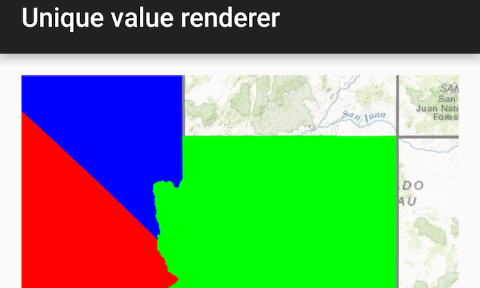

# Unique value renderer
This sample demonstrate how to use a unique value renderer to style different features in a feature layer with different symbols. Features do not have a symbol property for you to set, renderers should be used to define the symbol for features in feature layers. The unique value renderer allows for separate symbols to be used for  features that have specific attribute values in a defined field.



## Features
- ServiceFeatureTable
- SimpleFillSymbol
- SimpleLineSymbol
- UniqueValueRenderer

## Developer Pattern
First a service feature table and feature layer are constructed and added to the map. Then a unique value renderer is created and the field name to be used as the renderer field is set ("STATE_ABBR"). You can use multiple fields, this sample only uses one. Multiple simple fill symbols are defined for each type of feature we want to render differently (in this case different states of the USA). Simple fill symbols can be applied to polygon features, these are the types of features found in the feature service used for this service feature table. A default symbol is also created, this will be used for all other features that do not match the unique values defined.  Separate unique value objects are created which define the values in the renderer field and what symbol should be used for features that match. These are added to the unique values collection. The renderer is set on the layer and is rendered in the map view accordingly.

```java
// Create service feature table
ServiceFeatureTable serviceFeatureTable = new ServiceFeatureTable(getResources().getString(R.string.sample_service_url));

// Create the feature layer using the service feature table
FeatureLayer featureLayer = new FeatureLayer(serviceFeatureTable);

// Override the renderer of the feature layer with a new unique value renderer
UniqueValueRenderer uniqueValueRenderer = new UniqueValueRenderer();
// Set the field to use for the unique values
uniqueValueRenderer.getFieldNames().add("STATE_ABBR"); //You can add multiple fields to be used for the renderer in the form of a list, in this case we are only adding a single field

// Create the symbols to be used in the renderer
SimpleFillSymbol defaultFillSymbol = new SimpleFillSymbol(SimpleFillSymbol.Style.NULL, Color.BLACK, new SimpleLineSymbol(SimpleLineSymbol.Style.SOLID, Color.GRAY, 2));
SimpleFillSymbol californiaFillSymbol = new SimpleFillSymbol(SimpleFillSymbol.Style.SOLID, Color.RED, new SimpleLineSymbol(SimpleLineSymbol.Style.SOLID, Color.RED, 2));
SimpleFillSymbol arizonaFillSymbol = new SimpleFillSymbol(SimpleFillSymbol.Style.SOLID, Color.GREEN, new SimpleLineSymbol(SimpleLineSymbol.Style.SOLID, Color.GREEN, 2));
SimpleFillSymbol nevadaFillSymbol = new SimpleFillSymbol(SimpleFillSymbol.Style.SOLID,Color.BLUE, new SimpleLineSymbol(SimpleLineSymbol.Style.SOLID, Color.BLUE, 2));

// Set default symbol
uniqueValueRenderer.setDefaultSymbol(defaultFillSymbol);
uniqueValueRenderer.setDefaultLabel("Other");

// Set value for california
List<Object> californiaValue = new ArrayList<>();
// You add values associated with fields set on the unique value renderer.
// If there are multiple values, they should be set in the same order as the fields are set
californiaValue.add("CA");
uniqueValueRenderer.getUniqueValues().add(new UniqueValueRenderer.UniqueValue("California", "State of California", californiaFillSymbol, californiaValue));

// Set value for arizona
List<Object> arizonaValue = new ArrayList<>();
// You add values associated with fields set on the unique value renderer.
// If there are multiple values, they should be set in the same order as the fields are set
arizonaValue.add("AZ");
uniqueValueRenderer.getUniqueValues().add(new UniqueValueRenderer.UniqueValue("Arizona", "State of Arizona", arizonaFillSymbol, arizonaValue));

// Set value for nevada
List<Object> nevadaValue = new ArrayList<>();
// You add values associated with fields set on the unique value renderer.
// If there are multiple values, they should be set in the same order as the fields are set
nevadaValue.add("NV");
uniqueValueRenderer.getUniqueValues().add(new UniqueValueRenderer.UniqueValue("Nevada", "State of Nevada", nevadaFillSymbol, nevadaValue));

// Set the renderer on the feature layer
featureLayer.setRenderer(uniqueValueRenderer);
```
