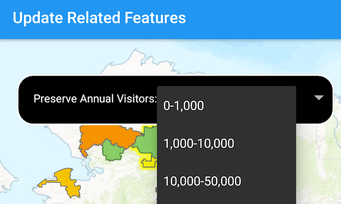

# Update Related Features



The Update Related Features app has a `MapView` loaded with two related `FeatureLayer`'s, national parks and preserves.  The relationships between the layers is defined in the service. When you tap on a national park `Feature` the app identifies the feature and performs a related table query then shows the annual visitors amount for the preserve. You can update the visitor amount by tapping the drop-down in the `Callout` and selecting a different amount. The app will apply the update on the server.  

## Features
* ArcGISFeature
* ServiceFeatureTable
* RelatedQueryParameters
* RelatedFeatureQueryResult

## Developer Pattern
When you tap on the map the app identifies if a feature is selected and queries for related features on its `FeatureTable`.  Results are shown in an editable `Callout` where you can update the visitor amount by selecting a new value from the drop-down list.  

```java
    /**
     * Query related features from selected feature
     * @param feature selected feature
     */
    private void queryRelatedFeatures(ArcGISFeature feature){
        final ListenableFuture<List<RelatedFeatureQueryResult>> relatedFeatureQueryResultFuture = mParksFeatureTable.queryRelatedFeaturesAsync(feature);

        relatedFeatureQueryResultFuture.addDoneListener(new Runnable() {
            @Override
            public void run() {
                try {
                    mProgressDialog.dismiss();
                    List<RelatedFeatureQueryResult> relatedFeatureQueryResultList = relatedFeatureQueryResultFuture.get();

                    // iterate over returned RelatedFeatureQueryResults
                    for(RelatedFeatureQueryResult relatedQueryResult : relatedFeatureQueryResultList){
                        // iterate over Features returned
                        for (Feature relatedFeature : relatedQueryResult) {
                            // persist selected related feature
                            mSelectedRelatedFeature = (ArcGISFeature) relatedFeature;
                            // get preserve park name
                            String parkName = mSelectedRelatedFeature.getAttributes().get("UNIT_NAME").toString();
                            // use the Annual Visitors field to use as filter on related attributes
                            String attributeValue = mSelectedRelatedFeature.getAttributes().get("ANNUAL_VISITORS").toString();
                            showCallout(parkName, attributeValue);
                            // center on tapped point
                            mMapView.setViewpointCenterAsync(mMapView.screenToLocation(mTappedPoint));
                        }
                    }
                } catch (InterruptedException e) {
                    e.printStackTrace();
                } catch (ExecutionException e) {
                    e.printStackTrace();
                }
            }
        });
    }
```

Apply updates on the server: 

```java
    /**
     * Update the related feature table and apply update on the server
     * @param visitors annual visitors value
     */
    private void updateRelatedFeature(final String visitors){
        // load the related feature
        mSelectedRelatedFeature.loadAsync();
        mSelectedRelatedFeature.addDoneLoadingListener(new Runnable() {
            @Override
            public void run() {
                if(mSelectedRelatedFeature.getLoadStatus() == LoadStatus.LOADED){
                    // put new attribute value
                    mSelectedRelatedFeature.getAttributes().put("ANNUAL_VISITORS", visitors);
                    // update feature in the related feature table
                    ListenableFuture<Void> updateFeature = mPreservesFeatureTable.updateFeatureAsync(mSelectedRelatedFeature);
                    updateFeature.addDoneListener(new Runnable() {
                        @Override
                        public void run() {
                            // apply update to the server
                            final ListenableFuture<List<FeatureEditResult>> serverResult = mPreservesFeatureTable.applyEditsAsync();
                            serverResult.addDoneListener(new Runnable() {
                                @Override
                                public void run() {
                                    try {
                                        // check if server result successful
                                        List<FeatureEditResult> edits = serverResult.get();
                                        if(edits.size() > 0){
                                            if(!edits.get(0).hasCompletedWithErrors()){
                                                mParksFeatureLayer.clearSelection();
                                                mProgressDialog.dismiss();
                                                Toast.makeText(getApplicationContext(), getResources().getString(R.string.update_success), Toast.LENGTH_SHORT).show();
                                                // show callout with new value
                                                mCallout.show();
                                            }else{
                                                mProgressDialog.dismiss();
                                                Toast.makeText(getApplicationContext(), getResources().getString(R.string.update_fail), Toast.LENGTH_LONG).show();
                                            }
                                        }
                                    } catch (InterruptedException e) {
                                        e.printStackTrace();
                                    } catch (ExecutionException e) {
                                        e.printStackTrace();
                                    }
                                }
                            });
                        }
                    });
                }
            }
        });
    }
```